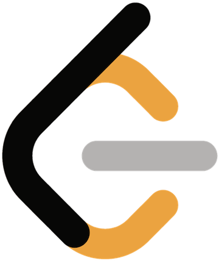
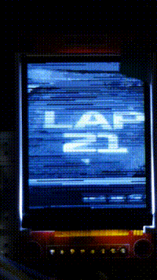

<!--
**ChrisStewart132/ChrisStewart132** is a ✨ _special_ ✨ repository because its `README.md` (this file) appears on your GitHub profile.

Here are some ideas to get you started:

- 🔭 I’m currently working on ...
- 🌱 I’m currently learning ...
- 👯 I’m looking to collaborate on ...
- 🤔 I’m looking for help with ...
- 💬 Ask me about ...
- 📫 How to reach me: ...
- 😄 Pronouns: ...
- ⚡ Fun fact: ...
-->

## About
- 🎓 Computer Science Graduate (BSc)
- 🌟 Favourite Data Structure: Binary Heap
-   [Leetcode](https://leetcode.com/u/Christopher1337/)

| Python | C | C#| JavaScript| HTML| CSS|Java|C++|
|----------|----------|----------|----------|----------|----------|----------|----------|
|  	 |	  |	|	|	|	|	|	
## Unity2d Ballistic Interception (Project010326)

### https://ballistics.nullxeno.com/

## Gym Website
https://chrisstewart132.github.io/GymV2.5/

## Project2803
https://chrisstewart132.github.io/Project2803_progress/

## CNNObjectDetector
[https://github.com/ChrisStewart132/pytorch_apps/tree/main/CNNObjectDetector](https://github.com/ChrisStewart132/pytorch_apps/tree/main/CNNObjectDetector)

https://github.com/user-attachments/assets/d3eef2e1-9e62-476a-aa49-2d9c574daf69

https://github.com/user-attachments/assets/9cc6ba74-7342-4d7c-b017-8f7f30ebf912

https://github.com/user-attachments/assets/bbb1408d-38b7-4ba3-a820-77f4393eddd1

## ImageToImageCNN
https://github.com/ChrisStewart132/pytorch_apps/tree/main/ImageToImageCNN

https://github.com/user-attachments/assets/1fef5cf1-ce79-4e19-83bd-6c1445fd5be4

## ADXL335_GY_61 roll stabilization example
https://github.com/ChrisStewart132/ADXL335_GY_61

https://github.com/user-attachments/assets/b60ad539-0e36-4a60-a7a1-91f4118b5533

## NEO-6M-GPS raspberry pi pico GPS example
https://github.com/ChrisStewart132/NEO-6M-GPS

## NRF24L01 2.4Ghz Radio Transceiver Client-Server and Video Stream Demonstrations
https://github.com/ChrisStewart132/NRF24L01_RF

 

## ST7735S_LCD_Demo (128x160 setup, 2bit gray, 8bit gray, 16bit rgb565 picamera recording(s))
https://github.com/ChrisStewart132/rpi_ST7735S_LCD

   

## PCD8544_Nokia_5110_Display_Demo (84x48 binary threshold picamera recording(s))
https://github.com/ChrisStewart132/rpi_PCD8544_Nokia_5110_Display

 

## AStarPathFinding_Demo
https://github.com/ChrisStewart132/AStarPathFinding
<!----->

## Gym Website
https://chrisstewart132.github.io/gymV2/

## Unicode Website
https://chrisstewart132.github.io/Unicode-website

## Algorithms (WIP)
https://chrisstewart132.github.io/Website/algorithms.html

